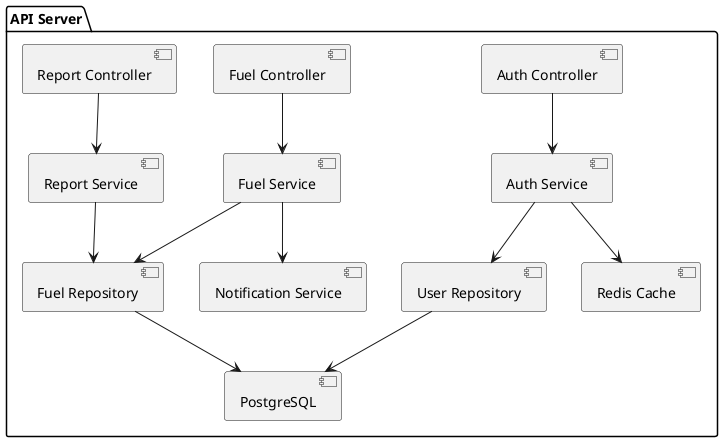

# Architecture Patterns & System Design

> **Mục tiêu:** Nắm vững kiến trúc phần mềm từ cơ bản đến nâng cao, tự áp dụng cho dự án Nhật Bản (CMMI Level 3)
> **Level:** L1 -> L2 -> L3
> **Thời gian đọc:** ~30 phút
> **Liên quan:** SE Competency #2 (Basic Design), CMMI PA: ENG-TS

---

## 1. Khái niệm cơ bản (L1)

### 1.1. Layered Architecture (Kiến trúc phân tầng)

Đây là pattern cơ bản nhất, phân chia hệ thống thành các tầng có trách nhiệm riêng biệt.

**Mô hình 3 tầng truyền thống:**

```
+---------------------------+
|   Presentation Layer      |  <-- UI, API Controllers
+---------------------------+
|   Business Logic Layer    |  <-- Services, Use Cases
+---------------------------+
|   Data Access Layer       |  <-- Repositories, ORM
+---------------------------+
|   Database                |  <-- PostgreSQL, MySQL
+---------------------------+
```

**Quy tắc:**
- Tầng trên CHỈ ĐƯỢC gọi tầng ngay bên dưới (không nhảy tầng)
- Tầng dưới KHÔNG ĐƯỢC gọi tầng trên
- Mỗi tầng có interface rõ ràng

**Ví dụ cụ thể (TypeScript):**

```typescript
// Data Access Layer
class FuelInfoRepository {
  async findById(id: string): Promise<FuelInfo | null> {
    return await db.query('SELECT * FROM fuel_info WHERE id = $1', [id]);
  }
}

// Business Logic Layer
class FuelInfoService {
  constructor(private repo: FuelInfoRepository) {}

  async getFuelInfo(id: string): Promise<FuelInfo> {
    const fuel = await this.repo.findById(id);
    if (!fuel) throw new NotFoundException('Fuel info not found');
    return fuel;
  }
}

// Presentation Layer
class FuelInfoController {
  constructor(private service: FuelInfoService) {}

  async getById(req: Request, res: Response) {
    const fuel = await this.service.getFuelInfo(req.params.id);
    res.json({ data: fuel, result: { code: 'success' } });
  }
}
```

### 1.2. Component Decomposition (Phân tách thành phần)

**Top-Down Decomposition** -- phân tách hệ thống từ tổng thể xuống chi tiết:

```
System (Fuel Management System)
  +-- Presentation Layer
  |     +-- Web UI (React)
  |     +-- Mobile App (React Native)
  +-- Application Layer
  |     +-- Auth Service
  |     +-- Fuel Management Service
  |     +-- Report Service
  |     +-- Notification Service
  +-- Data Layer
  |     +-- Database (PostgreSQL)
  |     +-- Cache (Redis)
  |     +-- File Storage (S3)
  +-- Integration Layer
        +-- External API Gateway
        +-- Message Queue
```

**Checklist phân tích L1:**
- [ ] Mỗi requirement có ít nhất 1 component chịu trách nhiệm?
- [ ] Không có component nào chịu trách nhiệm quá nhiều (God Component)?
- [ ] Mỗi NFR có chiến lược giải quyết rõ ràng?
- [ ] Integration points đã xác định đầy đủ?

### 1.3. Separation of Concerns

| Tầng | Trách nhiệm | KHÔNG làm |
|------|------------|-----------|
| Presentation | Hiển thị, nhận input | Truy vấn DB trực tiếp |
| Business Logic | Xử lý nghiệp vụ, validation | Biết cách render HTML |
| Data Access | Đọc/ghi database | Chứa logic nghiệp vụ |

---

## 2. Thực hành nâng cao (L2)

### 2.1. Clean Architecture

Clean Architecture (Robert C. Martin) tổ chức code theo vòng tròn đồng tâm, dependency chỉ hướng vào trong.

```
+-------------------------------------------------------+
|  Frameworks & Drivers (Express, React, PostgreSQL)     |
|  +---------------------------------------------------+ |
|  |  Interface Adapters (Controllers, Gateways, DTOs)  | |
|  |  +-----------------------------------------------+ | |
|  |  |  Application Business Rules (Use Cases)        | | |
|  |  |  +-----------------------------------------+   | | |
|  |  |  |  Enterprise Business Rules (Entities)   |   | | |
|  |  |  +-----------------------------------------+   | | |
|  |  +-----------------------------------------------+ | |
|  +---------------------------------------------------+ |
+-------------------------------------------------------+

Dependency Rule: --> chỉ hướng vào trong (inner layers KHÔNG biết outer layers)
```

**So sánh với Layered Architecture:**

| Tiêu chí | Layered | Clean Architecture |
|----------|---------|-------------------|
| Dependency direction | Trên gọi dưới | Ngoài gọi vào trong |
| DB coupling | Business phụ thuộc DB | DB phụ thuộc Business |
| Testability | Khó mock DB | Dễ test (DI) |
| Framework coupling | Cao | Thấp |
| Độ phức tạp | Thấp | Trung bình - Cao |
| Phù hợp | CRUD đơn giản | Logic nghiệp vụ phức tạp |

### 2.2. C4 Model (Context / Container / Component / Code)

C4 Model cung cấp 4 mức độ chi tiết để mô tả kiến trúc:

**Level 1 -- System Context:** Hệ thống trong bối cảnh rộng

```
+------------------+        +---------------------------+
|  Internal User   |------->|  Fuel Management System   |
|  (Operator/Admin)|        |  (Web Application)        |
+------------------+        +---------------------------+
                                |              |
                                v              v
                    +--------------+    +----------------+
                    | Email Service|    | Corporate LDAP |
                    | (SMTP)       |    | (Auth)         |
                    +--------------+    +----------------+
```

**Level 2 -- Container Diagram:** Các ứng dụng và database

| Container | Technology | Trách nhiệm |
|-----------|-----------|-------------|
| Web App (SPA) | React + TypeScript | Frontend UI |
| API Server | Node.js + Express | REST API |
| Database | PostgreSQL | Data persistence |
| Cache | Redis | Session & query cache |
| Worker | Node.js | Background jobs |

**Level 3 -- Component Diagram:** Các component trong 1 container



**Level 4 -- Code:** Class diagram, sequence diagram (chỉ khi cần)

### 2.3. ADR (Architecture Decision Record)

ADR ghi nhận các quyết định kiến trúc quan trọng và LÝ DO đằng sau.

**Template ADR:**

```markdown
# ADR-001: Chọn PostgreSQL làm database chính

## Status: Accepted

## Context
- Dự án quản lý nhiên liệu, dự kiến 50,000 bản ghi/tháng
- Cần hỗ trợ JSON data, full-text search
- Team có kinh nghiệm với PostgreSQL và MySQL

## Decision
Chọn PostgreSQL 15+ với JSONB support.

## Alternatives Considered
1. MySQL 8 -- Thiếu JSONB native, partition khó hơn
2. MongoDB -- Team không có kinh nghiệm, overkill cho structured data

## Consequences
- Positive: JSONB cho flexible schema, strong indexing, ACID compliance
- Negative: Scale write-heavy workload khó hơn MongoDB
- Risk: Accepted -- data volume chưa cần NoSQL scale
```

### 2.4. DDD Cơ bản (Domain-Driven Design)

| Khái niệm | Định nghĩa | Ví dụ (Fuel System) |
|-----------|-----------|---------------------|
| Entity | Object có identity duy nhất | FuelInfo (có fuel_info_id) |
| Value Object | Object không có identity | CalorificValue, UnitPrice |
| Aggregate | Nhóm entity có root | FuelInfo (root) + FuelSupplier |
| Repository | Interface truy cập data | IFuelInfoRepository |
| Service | Logic không thuộc entity nào | FuelPricingService |
| Bounded Context | Ranh giới nghiệp vụ | FuelManagement, Reporting |

---

## 3. Chiến lược & Dẫn dắt (L3)

### 3.1. Microservices vs Monolith Decision Matrix

| Tiêu chí | Trọng số | Monolith | Microservices |
|----------|---------|----------|---------------|
| Team size < 5 | 20% | 9 (1.8) | 3 (0.6) |
| Time-to-market nhanh | 20% | 8 (1.6) | 4 (0.8) |
| Scale độc lập từng module | 15% | 3 (0.45) | 9 (1.35) |
| DevOps maturity | 15% | 9 (1.35) | 3 (0.45) |
| Data consistency | 15% | 9 (1.35) | 5 (0.75) |
| Fault isolation | 15% | 4 (0.6) | 9 (1.35) |
| **Tổng** | **100%** | **7.15** | **5.30** |

**Quy tắc chọn:**

| Quy mô dự án | Khuyến nghị | Lý do |
|-------------|------------|-------|
| Size S (<100 MD) | Monolithic | Đơn giản, deploy dễ, team nhỏ |
| Size M (100-500 MD) | Layered / Clean Architecture | Cần tầm bằng maintainability và agility |
| Size L (>500 MD) | Microservices / Event-Driven | Cần scale, fault isolation, team autonomy |

**Lưu ý quan trọng:** PHẢI có DevOps maturity TRƯỚC khi chọn microservices. Nếu team chưa có CI/CD, container orchestration, monitoring -- KHÔNG chọn microservices.

### 3.2. Scalability Design

**Horizontal vs Vertical Scaling:**

| Phương pháp | Horizontal (Scale Out) | Vertical (Scale Up) |
|-------------|----------------------|-------------------|
| Cách làm | Thêm máy chủ | Nâng cấp CPU/RAM |
| Chi phí | Tuyến tính | Tăng nhanh ở ngưỡng cao |
| Độ phức tạp | Cao (stateless, load balancer) | Thấp |
| Giới hạn | Gần như không giới hạn | Giới hạn phần cứng |
| Downtime | Không (rolling update) | Có (khi nâng cấp) |

**Chiến lược cho từng component:**

| Component | Scaling Strategy | Ghi chú |
|-----------|-----------------|---------|
| API Server | Horizontal + Load Balancer | Stateless, dùng JWT |
| Database | Vertical + Read Replicas | Master-slave replication |
| Cache | Horizontal (Redis Cluster) | Shard theo key |
| Background Worker | Horizontal + Queue | Mỗi worker đọc từ queue |
| File Storage | Cloud Storage (S3) | Auto-scaling |

### 3.3. NFR Tradeoffs

| NFR | Tradeoff | Chiến lược |
|-----|----------|-----------|
| Performance vs Security | Encryption làm chậm | Encrypt sensitive data only, cache decrypted |
| Consistency vs Availability | CAP theorem | CP cho thanh toán, AP cho catalog |
| Cost vs Reliability | HA = chi phí gấp đôi | Multi-AZ cho production, single AZ cho staging |
| Flexibility vs Simplicity | Microservices phức tạp hơn | Start monolith, extract services khi cần |

### 3.4. Cloud Strategy

| Mục tiêu | On-Premise | IaaS | PaaS | Serverless |
|----------|-----------|------|------|-----------|
| Control | Cao nhất | Cao | Trung bình | Thấp |
| Cost (nhỏ) | Cao | Trung bình | Thấp | Rất thấp |
| Cost (lớn) | Thấp | Trung bình | Cao | Rất cao |
| Ops effort | Rất cao | Cao | Thấp | Rất thấp |
| Phù hợp | Enterprise, regulated | General | Startup, MVP | Event-driven |

---

## 4. Tự kiểm tra

### Bài tập 1 (L1): Mô tả Layered Architecture

Vẽ sơ đồ 3 tầng cho module "Quản lý Nhiên liệu" (Fuel Management):
- Liệt kê từng component trong mỗi tầng
- Mô tả luồng dữ liệu: User tạo Fuel Info -> Lưu DB -> Trả về kết quả

### Bài tập 2 (L2): Vẽ C4 Diagram

Vẽ đầy đủ C4 Model cho Fuel Management System:

**Level 1 (Context):**
- Actors: Operator, Admin, External Supplier System
- System: Fuel Management System
- External: Email Service, LDAP Auth

**Level 2 (Container):**
- Web App (React), API Server (Node.js), PostgreSQL, Redis, Background Worker

**Level 3 (Component) cho API Server:**
- Auth Controller/Service, Fuel Controller/Service, Report Controller/Service
- Repositories, Notification Service

**Yêu cầu:** Mỗi diagram phải có title, legend, và không quá 15 elements.

### Bài tập 3 (L3): Viết ADR

Viết ADR cho quyết định: "Chọn Monolith hay Microservices cho Fuel Management System?"

**Context:** 100 users, team 5 người, deadline 6 tháng, yêu cầu response time < 2s.

Dùng Decision Matrix (5 tiêu chí, cho điểm 1-10, có trọng số).

### Bài tập 4 (L3): NFR Analysis

Cho hệ thống Fuel Management với yêu cầu:
- 100 concurrent users
- Response time < 2 giây
- 99.9% uptime
- Dữ liệu nhạy cảm (giá nhiên liệu)

Thiết kế scaling strategy và giải quyết các NFR tradeoffs.

---

## 5. Tài liệu tham khảo

### Từ tài liệu nội bộ (CMMI)
- **GLN-ENG-TS-01** -- Hướng dẫn Thiết kế Cơ bản & Kiến trúc
- **GLN-ENG-TS-02** -- Hướng dẫn Thiết kế Chi tiết
- **RUL-ENG-TS-03** -- Tiêu chuẩn Lập trình
- **PRC-ENG-TS-01** -- Quy trình Architecture Design
- **PRC-ENG-TS-02** -- Quy trình Basic Design

### Từ khung năng lực SE
- **Competency #2 (Basic Design):** API list, DB design, common design, naming convention
- **Competency #3 (Detail Design):** API spec, screen spec, batch design, pseudo code

### Sách & Tài liệu bên ngoài
- "Clean Architecture" -- Robert C. Martin
- "Fundamentals of Software Architecture" -- Mark Richards, Neal Ford
- C4 Model: https://c4model.com
- ADR: https://adr.github.io
